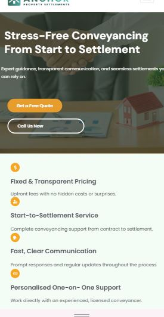
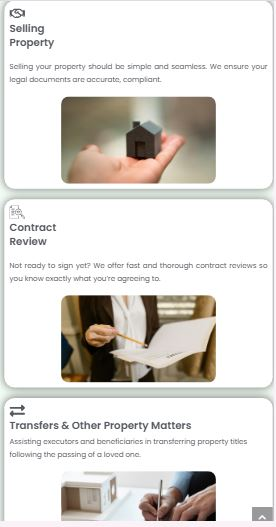
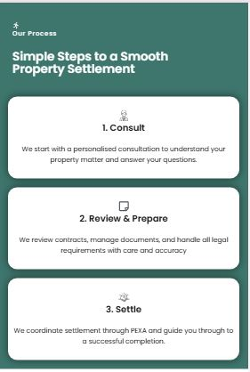
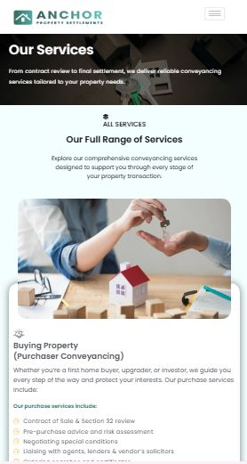
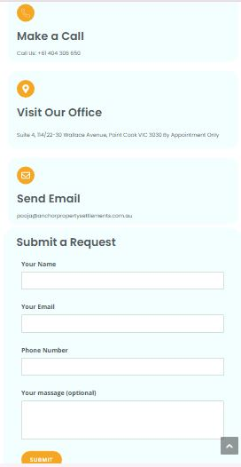

# Property Settlement Website

Professional WordPress website designed for a property settlement and conveyancing business.

## Project Overview

This website was created using WordPress and Elementor to provide a modern, trustworthy, and responsive online presence for a property settlement company.

## Features

- Responsive Design
- Service Showcase
- Contact Form
- Mobile Friendly Layout
- Professional User Interface
- Trust Building Testimonials

## Services Covered

- Property Buying
- Property Selling
- Contract Review
- Property Transfer Services

## Tools Used

- WordPress
- Elementor
- Basic SEO

## Live Demo

https://digitalonlinecourse.in/anchor/

## Screenshots

## Mobile Responsive Design

### Mobile Responsive

### Mobile Service Page

### Mobile Contact us Page

## Author

Satish Kumar
WordPress Website Designer
